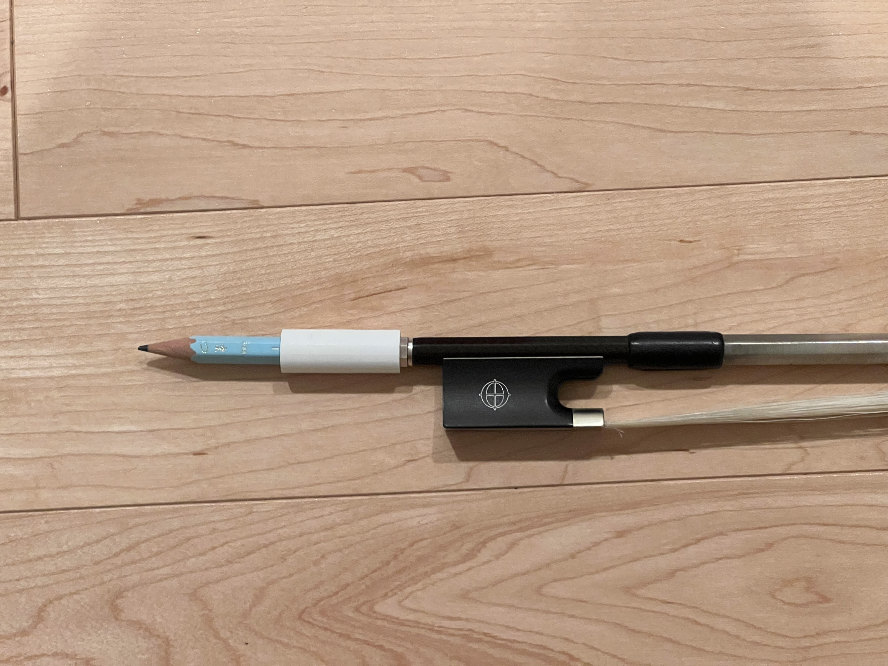
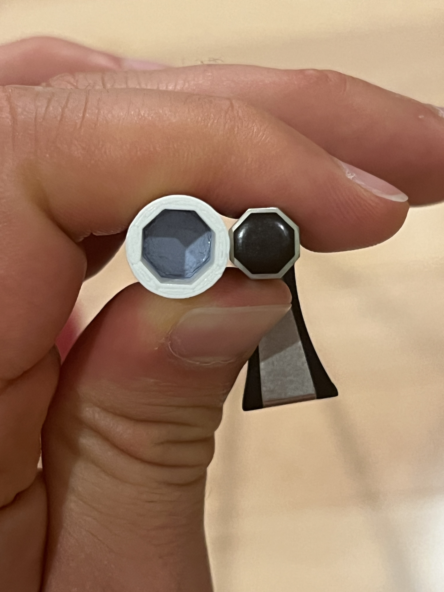

# Violin-to-Pencil-Converter
## Allows you to attach a pencil to the end of your violin bow so that you always have a pencil to annotate with during orchestra.
`Violin_to_pencil.stl`
## Images
**Violin to Pencil Converter**  
  
  